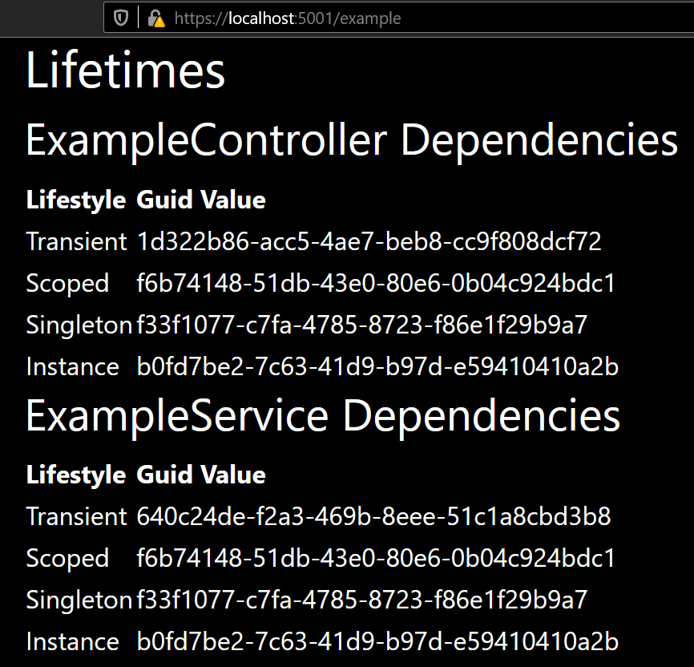
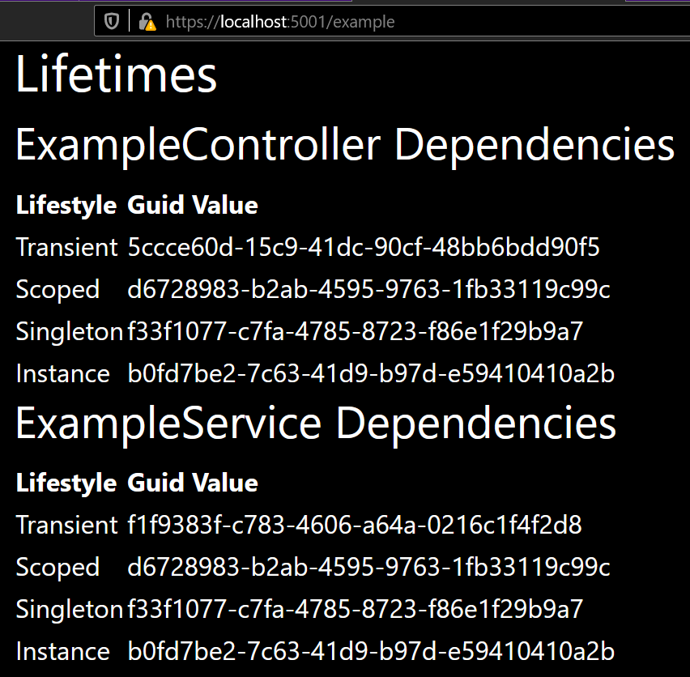

dependency injection and object life times
==========================================

From the excellent book Dependency Injection in .NET Core 2.0.

I have just added commentaries from the book on the appropiate places of the
Startup class.

The screen shots from the application are the following.

-   First request

-   Second request

I hope the commentaries would be self-explanatory along the screenshots.
